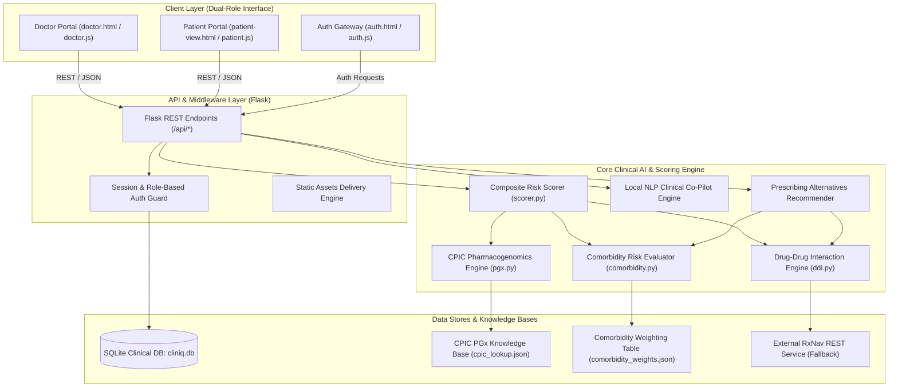

# Architecture: Clin.IQ System Design

## System Architecture

Clin.IQ follows a decoupled, local-first architecture engineered for high performance, deterministic reliability, and strict patient data privacy. The frontend interfaces communicate with a lightweight Python/Flask application server via a JSON REST API, which orchestrates the multi-factor pharmacological risk engine, local NLP co-pilot, and data stores.

---

## Component Table

| Component | Technology | Responsibility |
|---|---|---|
| **Clinician UI** | HTML5, CSS3, Vanilla JavaScript (ES6+) | Interactive clinical dashboard, dynamic SVG risk gauge, medication pill management, comorbidity selectors, real-time breakdown charts, and one-click drug replacement. |
| **Patient UI** | HTML5, CSS3, Vanilla JavaScript (ES6+) | Accessible patient health portal presenting plain-language medication regimens, chronological daily dosage timelines, food/activity warnings, and safety guidelines. |
| **Authentication Service** | Flask, SHA-256 / Secrets, Token Store | Role-based access control separating clinician and patient permissions, issuing secure session tokens, and validating user access to patient profiles. |
| **API Application Server** | Python 3, Flask, Flask-CORS | Orchestrates clinical requests, manages database sessions, handles CORS headers, and routes scoring requests to specialized evaluation modules. |
| **Composite Risk Scorer** | Python (`scorer.py`) | Synthesizes multidimensional inputs (DDIs, organ comorbidity weights, and genetic allele variants) into a standardized 0–100 composite risk score with severity stratification. |
| **DDI Evaluation Engine** | Python (`modules/ddi.py`) | Analyzes pairwise and combinatorial drug interactions, categorizes severity (minor, moderate, major, contraindicated), and interfaces with RxNav REST services when needed. |
| **Comorbidity Engine** | Python (`modules/comorbidity.py`) | Cross-references active patient diagnoses (e.g., CKD, CHF, Ulcers) against medication drug classes using curated clinical contraindication penalty weights. |
| **Pharmacogenomics Engine** | Python (`modules/pgx.py`) | Matches patient genomic alleles against international CPIC Level A/B clinical practice guidelines for instant gene-drug metabolic impairment warnings. |
| **Local NLP Clinical Co-Pilot** | Python / Rule-Based NLP | Extracts clinical entities, patient-reported symptoms, and medical notes locally with zero network latency and zero external cloud data transmission. |
| **Data Persistence** | SQLite 3 (`cliniq.db`) | Stores user credentials, hashed passwords, patient demographics, active medication lists, comorbidity records, and PGx profiles with WAL mode enabled. |

---

## Data Flow

1. **Authentication & Session Initialization:**
   The user logs in via `auth.html`. The Flask backend verifies hashed credentials against `cliniq.db` and returns a session token alongside the user's role (`doctor` or `patient`).
2. **Clinical Profile Loading:**
   Upon loading the Doctor dashboard, `doctor.js` requests the active patient record via `/api/patient/current`. The backend retrieves medications, comorbidities, and genetic biomarkers from SQLite.
3. **Regimen Evaluation Request:**
   When a clinician modifies medications or comorbidities, a payload containing `{medications: [...], comorbidities: [...], pgx_profile: {...}}` is dispatched to `/api/assess-risk`.
4. **Deterministic Parallel Evaluation:**
   - `modules/ddi.py` identifies pairwise drug interactions and scores severity.
   - `modules/comorbidity.py` cross-checks medications against organ-system comorbidities.
   - `modules/pgx.py` matches alleles against CPIC guidelines.
   - `scorer.py` aggregates all risk factors into a unified 0–100 risk score with dynamic breakdown metrics.
5. **Alternative Prescribing Recommendation:**
   For any high-severity interaction, candidate drug substitutions are evaluated. The alternative that minimizes net composite risk is returned in the response payload.
6. **Dynamic Dashboard Re-render:**
   The clinician dashboard animates the risk gauge, updates the interaction table, highlights contraindications, and displays one-click substitution buttons.
7. **Patient View Synchronization:**
   The patient portal translates the updated active prescription into human-readable schedules, meal instructions, and medication reminders.

---

## Security Considerations

- **Zero Cloud Exposure of PHI:** All clinical scoring and NLP parsing occurs locally in-memory. Patient health records are never broadcast to third-party generative AI cloud endpoints.
- **SQL Injection Prevention:** All database operations utilize parameterized queries (`sqlite3` parameterized placeholders) preventing SQL injection attacks.
- **Credential Protection:** Passwords are never stored in plaintext; secure hashing with salting is enforced.
- **CORS & Session Validation:** The Flask backend enforces token validation for protected patient endpoints and restricts cross-origin access.

---

## Scalability & Production Readiness

- **Stateless Scoring Logic:** The scoring engine (`scorer.py`) and knowledge modules are completely stateless, allowing horizontal scaling across multiple Gunicorn workers or containerized instances.
- **Pluggable Database Layer:** The SQLite backend can be substituted with PostgreSQL or IBM Cloudant by swapping the database connector URI in `.env`.
- **Pre-indexed Knowledge Bases:** CPIC guidelines and comorbidity matrices are loaded into indexed memory structures at process startup for sub-millisecond lookups.
